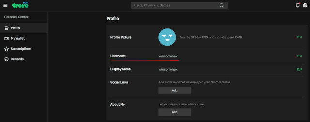

# plugin.video.trovo

See the KODI 19 branch for a version that will install/run on KODI 19 Matrix

Welcome to my Trovo addon for KODI. This add-on allows you to view streams and replay on the https://trovo.live streaming site.

I hope you get some use out of it. Feel free to feedback any suggestions and/or code improvements.

Instructions:

* Set your Trovo name. You can do this on the settings screen for the add-on. Ideally open the settings before you run the add-on, but you can also open the settings screen from the add-on's first menu option.

You can get you user name from the Trovo website. The profile screen is shown below.

Once you have given the add-on your display name, it will access the Trovo website to get the list of streamers you follow. 

NOTE: You will not be asked for a password. This is not a security problem. You can see who other users follow via the Trovo website.  The add-on is not designed to replace the functions of the website for managing your account. For example: if you want to follow or unfollow a streamer you need to login to your account on the Trovo website. This add-on only uses publicly available information and allows you to view streams. It does NOT require special access or permissions to your Trovo account and cannot access your account's private settings or data.

By default the username is set to Trovo - the offical Trovo account.

Open the addon and it will show the main menu:

1) Set your Trovo user
2) Currently live streamers you follow
...

Selecting option 1 will allow you to enter your Trovo display name - example: RevengeoftheCis (NOTE: this is case sensitive) - you do not need to supply a password

Option 2 will list any Trovo user you are following that is also live at the moment.

Once you have a list of streams, select one and... enjoy watching.

## Disclaimer

It's yours. If you break it, you can keep the pieces. If you want to add stuff feel free. You just need to follow the GPL and make your improvements available to others.

## Support
Like KODI, this add-in code is free and will remain so. If you'd like to support work on it, then it would be appreciated. Throw a few satoshis (Bitcoin) to:

3LNnxm4NbpcSs1eqSnndvx83zCx6mwqf7K
